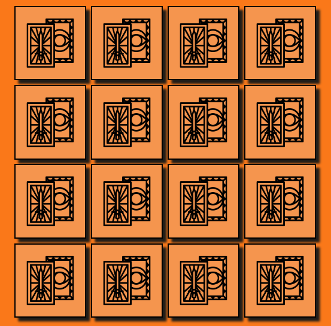
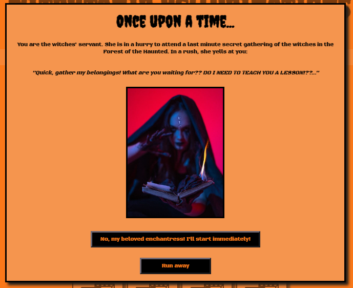
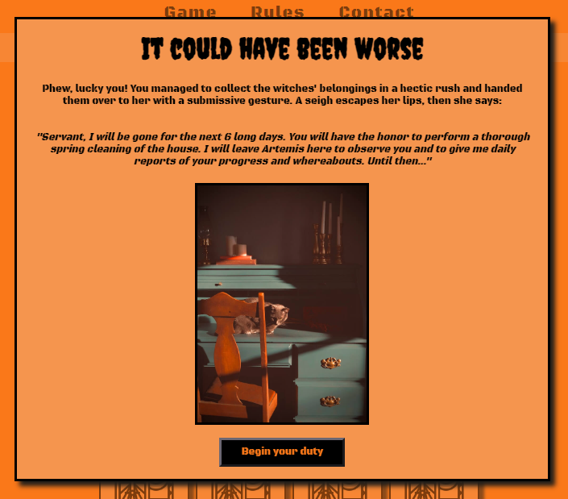
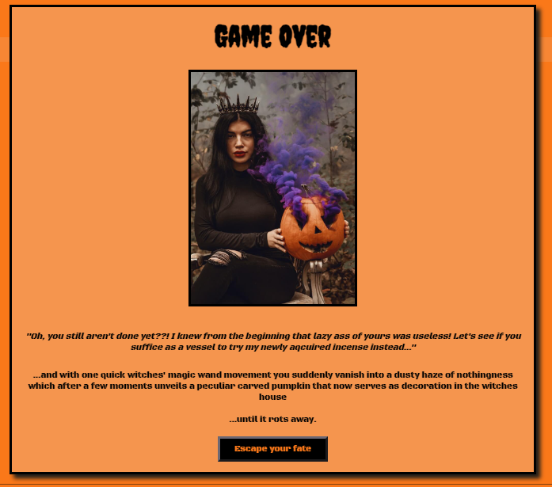
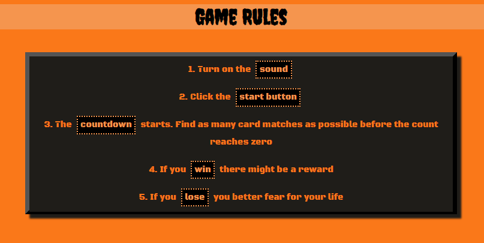
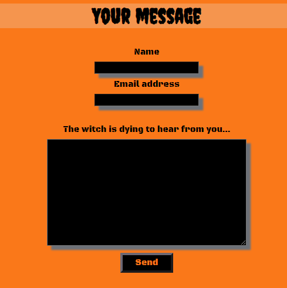
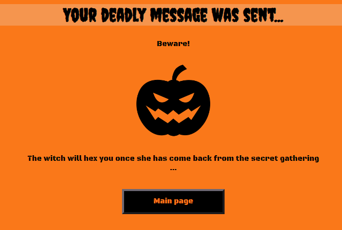

# Code Institute: JavaScript Project by Rafaela Wetzel

The second milestone project is about creating an interactive front-end website and showcasing the HTML, CSS and JavaScript skills I have attained over the past three months at Code Institute. It is the second out of five projects.  

# Witchtanic Hellucinations

The idea for Witchtanic Hellucinations came in early November when the Halloween-mood lasted a few days longer than October 31st. I wanted to create something fun combined with a spooky vibe that turned out to become a witch-themed memory card game and homepage. It is not only a game though but also engages the user in the storyline which rounds off the whole experience.

# Table of Contents

- [Code Institute: JavaScript Project by Rafaela Wetzel](#)
- [Witchtanic Hellucinations](#)
- [Table of Contents](#table-of-contents)
- [Live Demo](#live-demo)
- [UX](#ux)
  - [User Stories](#user-stories)
  - [Strategy](#strategy)
  - [Scope](#scope)
  - [Structure](#structure)
  - [Skeleton](#skeleton)
    - [Wireframe](#wireframe)
  - [Surface](#surface)
    - [Color Palette](#color-palette)
- [Technologies](#technologies)
- [Features](#features)
  - [Main Page](#main-page)
    - [Header and Navigation Bar](#header-and-navigation-bar)
    - [Controls Bar](#controls-bar)
    - [Card Matching Game](#card-matching-game)
  - [The Modals](#the-modals)
    - [Start Modal](#start-modal)
    - [Win Modal](#win-modal)
    - [Lose Modal](#lose-modal)
  - [Rules Page](#rules-page)
  - [Contact Page](#contact-page)
  - [Contact Confirmation Page](#contact-confirmation-page)
- [Features Left to Implement](#features-left-to-implement)
- [Testing](#testing)
    - [Testing Homepage Functions](#testing-homepage-functions)
    - [Testing Homepage Responsiveness](#testing-homepage-responsiveness)
  - [Validator Testing](#validator-testing)
  - [Lighthouse](#lighthouse)
  - [Bugs & Problems](#bugs--problems)
  - [Unfixed Bugs](#unfixed-bugs)
- [Deployment](#deployment)
- [Credits](#credits)
  - [Tutorials](#tutorials)
  - [Media](#media)
  - [Acknowledgements](#acknowledgements)

# Live Demo 

**You can see a deployed version of my website [here](https://rafaela-wetzel.github.io/Witchtanic-Hellucinations/)**

# UX

The target group is people who like to play online games, are fans of horror, supernatural figures & all things dark and look for spooky amusement. 

## User Stories

When a user enters the homepage for the first time they might want to know:  

- **What is this page about?** *The title in the browser tab already points at the page being about a card matching game which is also visually conveyed through the playing cards in the center of the main page. If the user should still wonder how everything works they can visit the rules page for more information.*
- **How do I start the game?** *There is a clearly visible start button which very likely will not be missed. There are only few elements on the homepage so chances that the start button feature might be overlooked is very low.*
- **What other interactions does the homepage have to offer?** 
  - *Centered on the main page there is a typical "Play audio" symbol that can be clicked which is also emphasized by the cursor pointer change. So while playing the game the user can have some spooky music in the background but also disable it if they do not like it.*
  - *They can get in touch via the contact page. If the contact form has been sent successfully the user will be redirected to a "message sent" confirmation page.*   

## Strategy

The objective of the project is to design a spooky witch memory card game whose outcome is influenced by the users' effort. The homepage entertains and also engages the user in the storyline rather than just playing a simple game without context. The functions and visual design are meant to emphasize and fit the mood and storyline of the game. At last it was also important to me to make sure it is easy to understand what the game is about when starting to play. 

## Scope

The homepage features a main page to play, a rules page and a possibility to get in touch and/or leave feedback. There is also the possibility to listen to spooky music while playing.

## Structure 

The homepage is split up into four separate pages: the visible main, rules and contact pages and a hidden contact confirmation page. The visible pages can be reached through the navigation menu just below the "Witchtanic Hellucinations" header. There are also three hidden modal windows that will become visible upon starting and winning or losing the game. 

**Page overview**:

1. **Main page**: a card game board consisting of 16 cards (which equal to 8 card matches), a start game button, a play audio button and a countdown timer that begins when the user has clicked 'start' in the first pop up modal.
2. **Rules page**: a rectangular surface presents the 5 relevant steps of playing the game.
3. **Contact page**: there is a name and e-mail field as well as a textarea to leave a personal message that will be forwarded to my e-mail inbox.
4. **Contact confirmation page**: when the user has sent the message they will be redirected to a page that confirms that their message has been sent. There is also a 'return to main page' button.
5. **Modal windows**
   - *Start modal*: When clicking the start button a modal window appears that introduces the story and setting of the game. Buttons indicate that the user can either close the window or begin the game.
   - *Winning modal*: If the user has found all 8 card matches before the countdown reaches zero, a winning modal will be displayed that tells a 'happy' ending of the story. There is a button below to close the modal window.
   - *Losing modal*: If the user fails to collect all card pairs and the countdown has reached zero, a 'game over' modal will be displayed that tells the macabre ending of the story. There is a button below to close the modal window.

## Skeleton

### Wireframe 

## Surface

The design is meant to go hand in hand with the witchy theme of the page. It features a very typical Halloween-pumpkin-orange background color, black font color for dark souls and shades of grey and white in between. I chose the 'Creepster' font for the main headings because it fits the spooky mood of the page. The back face of the playing cards shows two tarot cards and indicate that the 16 fields on the main page are playing cards. I have chosen 8 colored playing card illustrations for the front faces that are most likely to be associated with witches: a black cat, a broom, a cauldron, an exilir glass, a crystal ball, an incense, a magical book and crystals. 

When the modal windows are triggered they show three different pictures: a conjuring witch with a magical book in her hands, a cat sitting on a desk and a witch sitting on a chair outside with a pumpkin in her hands that evaporates purple smoke. The pictures are chosen to visualize the different situations in the storyline and give the user some food for imagination. 

Apart from the visuals and card game the storyline is interwoven with the homepage: the user can "Search the witches house", reply "No, my beloved enchantress! I'll start immediately!" or run away frightened, "Begin your duty" or "Escape your fate". Those messages are conveyed through headers or clickable buttons. On the contact page the user learns that "The witch is dying to hear from you..." and receives the confirmation "Your deadly message was sent" after successfully using the contact form. In the very end they also receive the ominous message that the witch will hex them once she has come back from the secret gathering on the contact confirmation page. In the end this means that the storyline not only plays a role in the context of playing the game but also incorporates the overall websites' approach to form an integral user experience.

### Color Palette     

   

# Technologies

- Balsamiq for creating a first wireframe  
- HTML & CSS for creating and styling the homepage  
- Javascript for adding interactivity to the homepage
- Microne music player code for implementing an audio player element
- Lighthouse for checks on performance, accessibility, best practices and SEO  
- Dev Tools for analyzing the homepage and checking responsiveness on different screen sizes

# Features 

## Main Page

### Header and Navigation Bar

The navigation bar which is part of the header is positioned horizontally and centered at the top of the page just below the "Witchtanic Hellucinations" writing. The navigation bar elements are "Game" (= main page), "Rules" and "Contact" and lead to the respective pages. When the elements are hovered over they change color from black to white to indicate that they are clickable.

### Controls Bar

The main page consists of a centered heading named "Search the witch house..." which points at what the game is about, namely to find items aka card matches. Just below the heading there are three elements positioned horizontally next to each other: 
  - A rectangular "Start" button to the left that triggers the start modal window. Once the game has begun the "Start" lettering is replaced by "End" so the user can end the game while the countdown is still running if they should not want to continue to play. After clicking the "End" button, it is replaced by the "Start" button again. Both "Start" and "End" buttons change color from black to white when hovered over.
  - A round button visualized with a triangle symbol within that is commonly associated with the "Play audio" function. Upon clicking there is a 48 seconds long instrumental audio playing in a loop that empasizes the spooky nature of the page. When the music starts to play upon clicking the triangle symbol it changes to two vertical lines placed next to each other to symbolize a "Stop music" function. Once this has been clicked, the music stops and the triangle is visible again.   
  - A rectangular element to the right showing a "Time" placeholder which is replaced by a countdown from 40 to 0 once the game has started. When it has reached zero and the winning or losing modal window has been triggered and then closed by the user, the respective number disappears and is replaced by "Time" again.

### Card Matching Game

On the main page there are 16 covered playing cards in rows of 4x4. They all show their back face and represent the focus of the homepage. Hidden behind the cards are 8 motives that occur twice each and represent a card match. When the page has loaded the cards are not clickable (yet) until the user triggers the start button in the first modal window. The timer then starts to run and the user can unveil two cards simultaneously that will show a rotating effect from back to front face when clicked. If the two cards are equal they stay uncovered, if they are not equal they are covered again. The game continues until either the user has found all card matches before the countdown has reached zero and the winning modal is triggered, or until the countdown has reached zero while the user has not found all card matches so the losing modal is triggered. Once the winning or losing modals have been closed, the front card faces will be concealed again and the 16 cards shuffled for the next playing round.     

## The Modals

All clickable modal window buttons change color from black to white when hovered over.

### Start Modal

When the start modal window is triggered there is a picture of a hooded witch with a magical book in her hands. The imagery is supposed to visualize the beginning of the story that tells the user (who is in the role of the servant): 'Hurry up to collect my belongings (the card matches) for the secret witch meeting'. The witches' vibe in the picture is a conjuring, threatening one that underlines the haste to leave for the meeting and the urgency for the servant to collect her items ('What are you waiting for?? DO I NEED TO TEACH YOU A LESSON!??...'). 

The user then can decide to start the game by clicking the 'No, my beloved enchantress! I'll start immediately!' button or close the window by clicking the 'Run away' button. 

### Win Modal

If the user manages to collect all card matches before the countdown has reached zero a modal window with the heading "It could have been worse" and a picture of a cat sitting on a desk is displayed. The 'reward' for collecting the witches' items in time is to have the honor to do a spring cleaning of the house while the witch is attending the secret gathering. In the meantime she leaves her cat at home to observe the servant and to regularly report to the witch. The user can then close the window by clicking the "Begin your duty" button.

### Lose Modal

If the user fails to find all card matches before the countdown has reached zero there is a "Game Over" modal window displayed with a picture of a witch sitting outside on a chair, holding a carved pumpkin in her hands that evaporates purple smoke. The witch is disappointed and angry that the servant failed at the task. She decides to cast a spell that turns them into a carved pumpkin that serves as a vessel for trying her new incense until the pumpkin (the cursed servant) naturally rots away with time. The user then can close the modal by clicking on the "Escape your fate" button.

## Rules Page

The Rules Page contains a grey surfaced rectangular element displaying five game rules: 
 - The advice to turn on the audio while playing
 - The hint to click the start button to begin the game
 - Mentioning a countdown and the task to collect as many card matches as possible before the countdown has reached zero
 - Luring the user that there might be a reward upon winning the game
 - Threaten the user that they might have to fear for their life when losing the game

The rules are displayed as an ordered list within the element with the main rules keywords (sound, start button, countdown, win, lose) visually emphasized. 

## Contact Page 

The Contact Page displays a contact form with three input fields for name, e-mail and personal message as well as a "Send" button below. The textarea field heading tells the user that "The witch is dying to hear from you..." and carries the storyline even further to the contact page. For the user to be able to send the message all three fields have to be filled out and will show an alert if any of them is left empty. Once the message is submitted it will be forwarded to my e-mail inbox and the user will be redirected to the hidden contact confirmation page.

## Contact Confirmation Page

When the message has been sent successfully the user will see a contact confirmation page with the heading "Your deadly message was sent..." and the information "Beware! The witch will hex you once she has come back from the secret gathering..." displayed. There is an image of a grim black pumpkin and a "Return to Main Page" button. Both the buttons on the contact form and contact confirmation page change color from black to white when hovered over.

## Features Left to Implement

Some ideas what could be added to the homepage in future:

### Accessibility

- Adding three buttons for game difficulty: Easy (50 seconds), Average (40 seconds), Hard (30 seconds)
- Having the option of hearing the countdown timer when seeing is not possible
- On top of having added alt text to the playing cards making them keyboard focusable 

# Testing 

I have tested the responsiveness of my homepage with Firefox, Google Chrome and Microsoft Edge Dev Tools and checked the following screen sizes: 360px (Galaxy S5 Android 5 on DevTools and my own mobile phone Moto G50), 576px, 768px, 992px and 1200px (DevTools and my own laptop Lenovo ThinkPad X260). I confirm that the actions below work on all screen sizes.

## Testing Homepage Functions

## Testing Homepage Responsiveness
    
**360px:** 
  
**576px:**  
  
**768px:** 
  
**992px:**
  
**1200px:**
     
**General**

## Validator Testing

- I confirm that no errors were returned when passing through the official [W3C validator](link)
  
  

- I confirm that no errors were returned when passing through the official [(Jigsaw) validator](link)
  

- I confirm that no errors were returned when passing through [JS Hint](https://jshint.com/)
  

## Lighthouse

## Bugs & Problems

- For the contact `<form>` I added an event listener so that the user would be redirected to the contact confirmation page once 'Send' had been clicked. After a lot of research and even though I did not see any obvious errors with my own JS code it still did not work and the function had not been triggered. I solved this by adding the redirection page link to the EmailJS function code directly. 

## Unfixed Bugs

No unfixed bugs.

# Deployment

The Witchtanic Hellucinations homepage was deployed through GitHub Pages. The steps are as follows:  
  
- From the main project page on GitHub, navigate to *Settings*
- On the left side click on *Pages*
- Choose *Deploy from a branch*
- Set the branch to *main* and * */ (root)* and click on *Save* 
- After a few moments the live link shows at the top of the page.

It can be found here: https://rafaela-wetzel.github.io/Witchtanic-Hellucinations/

# Credits 

## Tutorials 

[1] How to create a modal box  
https://www.w3schools.com/howto/howto_css_modals.asp

[2] How to create a countdown timer  
https://www.shecodes.io/athena/52336-how-to-create-a-countdown-timer-in-javascript+

[3] How to create a match count that displays a final win message  
https://stackoverflow.com/questions/54171904/javascript-memory-game-need-to-add-congrats-message-at-the-end-of-game 

[4] How to create a memory game  
https://www.youtube.com/playlist?list=PLLX1I3KXZ-YH-woTgiCfONMya39-Ty8qw  
https://github.com/code-sketch/memory-game/ 

[5] Microne music player code  
https://github.com/kodedninja/microne/tree/master

## Media

- All playing card motives, black pumpkin graphic and favicon taken from [Flaticon](https://www.flaticon.com/)
- Witch and cat pictures as shown in the modals taken from [Unsplash](https://unsplash.com/)  
- Audio taken from [Free Music Archive](https://freemusicarchive.org/music/dtat/horror-vacui/inager/)  

## Acknowledgements

- Help and feedback from my mentor Oluwafemi Medale
- README.md structure taken from [Anjalee Kulasinghe](https://github.com/anjalee-kulasinghe/portfolio-project1-cv-website/blob/main/README.md)
- Witchtanic Hellucinations title originally by US-band Acid Witch     

## Misc    

- Spooky sounds & cursor

Maybe at a later point:
- Levels of difficulty

Take into account:
- Accessibility / Keyboard-focussable
- Card match count

- Background picture? 
- What can user do? See GitHub repo